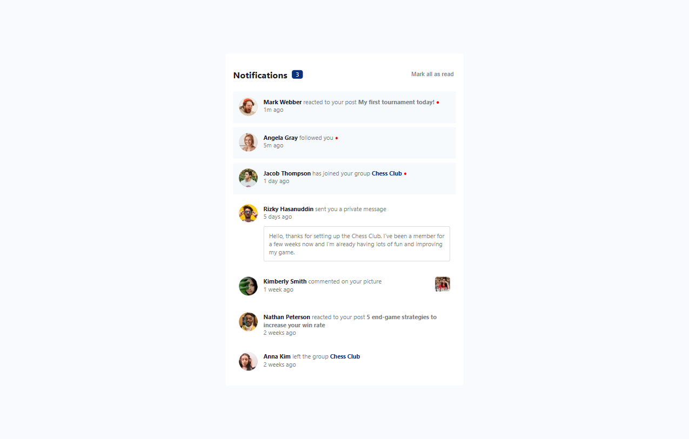

# Frontend Mentor - Notifications Page Solution

This is my solution to the [Notifications Page Challenge](https://www.frontendmentor.io/challenges/notifications-page-DqK5QAmKbC) on Frontend Mentor.

## Table of Contents

- [Overview](#overview)
  - [The Challenge](#the-challenge)
  - [Screenshot](#screenshot)
  - [Live Preview](#live-preview)
- [Development Process](#development-process)
  - [Built With](#built-with)
  - [Key Takeaways](#key-takeaways)
  - [Future Improvements](#future-improvements)
- [Author](#author)

## Overview

### The Challenge

Users should be able to:

- Identify "unread" and "read" notifications
- Use "Mark all as read" to toggle unread notifications and reset the unread count to zero
- View an optimal layout across different screen sizes
- See hover and focus states for interactive elements

### Screenshot

### Live Preview

- **Solution URL:** [Frontend Mentor Solution](https://www.frontendmentor.io/solutions/your-solution-url)
- **Live Site URL:** [Live Demo](https://notifynet.netlify.app/)

## Development Process

I followed a structured approach to building this project:

1. **Project Setup:** Initialized the project with the necessary files and dependencies.
2. **HTML Structure:** Created a semantic structure for the notification component.
3. **Styling:** Designed the layout using CSS and ensured responsiveness.
4. **Functionality:** Implemented interactivity with JavaScript and React state management.
5. **Bug Fixes & Refinements:** Resolved minor issues and improved UI.
6. **Documentation:** Created this README file to document the project.
7. **Deployment:** Uploaded the project to GitHub and hosted it online.

### Built With

- **Semantic HTML5** for clean and accessible markup
- **CSS custom properties** for better maintainability
- **Flexbox** for layout structuring
- **JavaScript** for interactivity
- **React** for state management and UI updates
- **Git & GitHub** for version control
- **Desktop-first workflow** for initial design, later adapted for mobile

### Key Takeaways

While working on this project, I improved in several areas:

- **State Management in React:** Learned how to toggle notification states using `.map()` without creating unnecessary duplicates.
- **Component-based Structure:** Gained experience in breaking UI into reusable React components.

### Future Improvements

I plan to enhance this project by:

- Improving **responsive design** for a better mobile experience.
- Implementing **animations** for a smoother UI experience.
- Adding **dark mode support** to improve accessibility.
- Adding **sorting** functionality

## Author

- **GitHub:** [Muhammad Uman Ijaz](https://github.com/UmanIjaz)
- **Frontend Mentor:** [@UmanIjaz](https://www.frontendmentor.io/profile/UmanIjaz)
- **LinkedIn:** [umanijaz](https://www.linkedin.com/in/umanijaz/)
